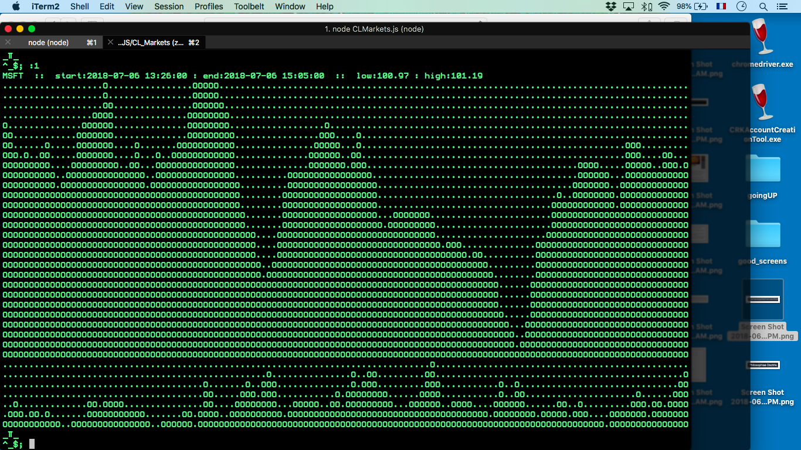

# CL_Markets
a node.js command line tool to view charts from stocks, crypto currencies, and currency spot data

## LATEST VERSION: CLMarkets.js
#### DATE: 2018 07 6

### DEPENDENCIES
#### : NodeJS 8+

## REQUIREMENTS: Alpha Vantage API key
an API key can be requested at this adress:  https://www.alphavantage.co/support/#support

documentation can be found here: https://www.alphavantage.co/documentation/

## PLEASE READ ALPHA VANTAGE's TERMS AND CONDITIONS AND ADHERE TO THEIR GUIDELINES ESPECIALLY REGARDING FREQUENCY OF API CALLS

there are ways to obtain high volume data streams but these must be negotiated with Alpha Vantage

### INSTALLATION INSTRUCTIONS:
## 1) Download a recent version of nodeJS (9 or higher is best)

## 2) 
download or clone this repository. 

## 3) 
In the file named 'api_key.js' replace YOURAPIKEY with your api key obtained from https://www.alphavantage.co/support/#support
as outlined in the REQUIREMENTS section above

## 4)
run `node CLMarkets.js` in your project directory

you should be in the interactive REPL (read-evaluate-print-loop) of the program

hit `<ENTER>` or enter one of the following commands. all commands must be prefixed by one of the following symbols:
$stock
¢crypto
£currency/pair
:interval (1,5,15,30,60,i,d,w,m)
\#chart_type (line, bar, ohlc)

#### Examples Commands

$GOOG :15 :bar  --> produces a bar graph of GOOG with ~15 min intervals
:30             --> produces a bar graph of GOOG with ~30 min intervals
:m\ #ohlc       --> produces an ohlc (open high low close) graph of GOOG in monthly intervals
$AMZN #line     --> produces a line graph of AMZN in monthly intervals
¢btc/eur        --> produces an ohlc graph of btc vs eur
£cad/gbp        --> returns spot price for currency pair (pairs must be in proper one/two format)
